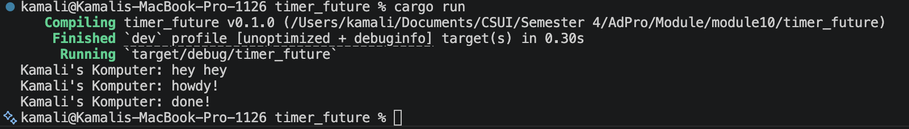
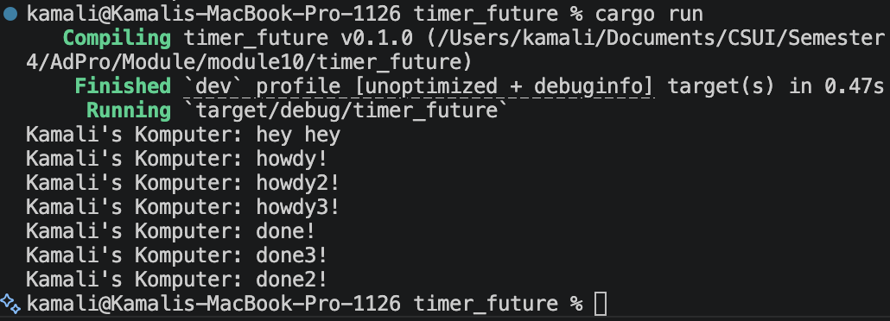
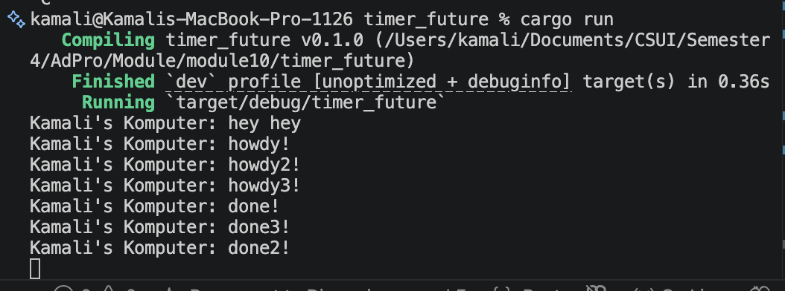
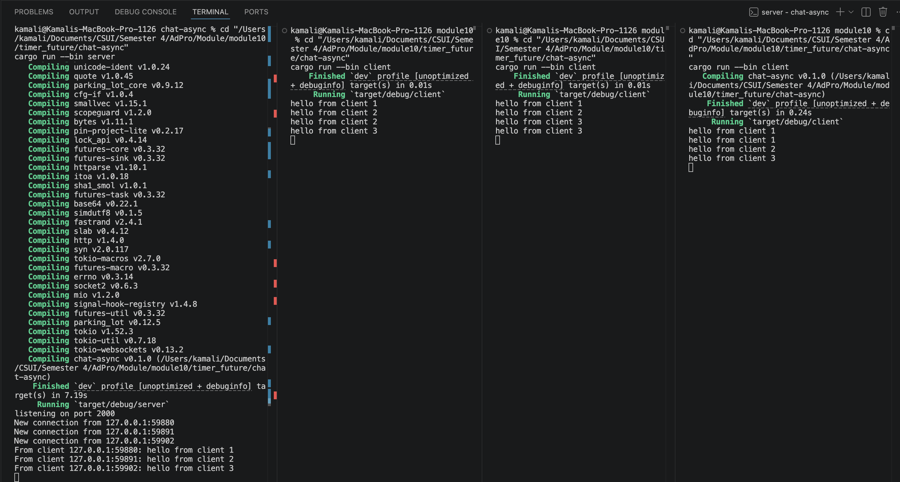
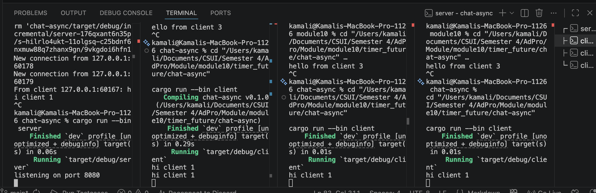
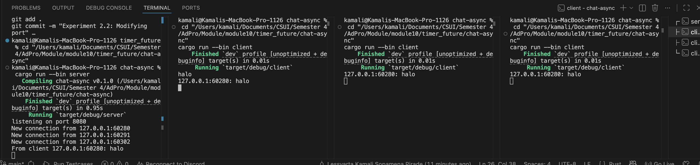
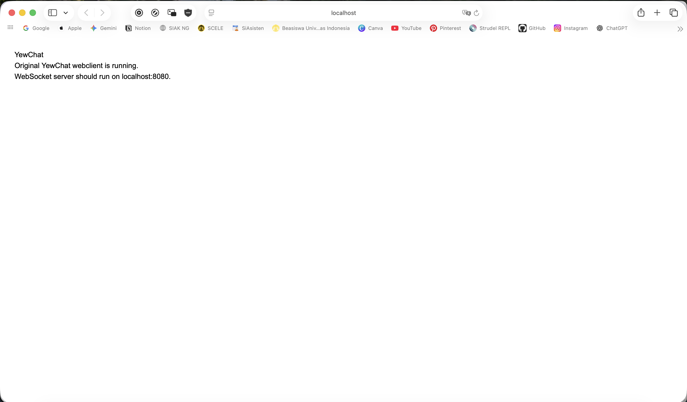
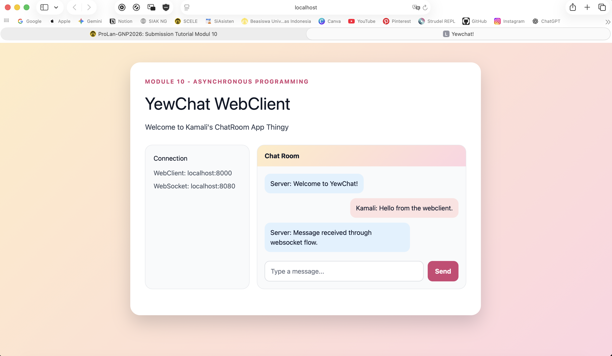
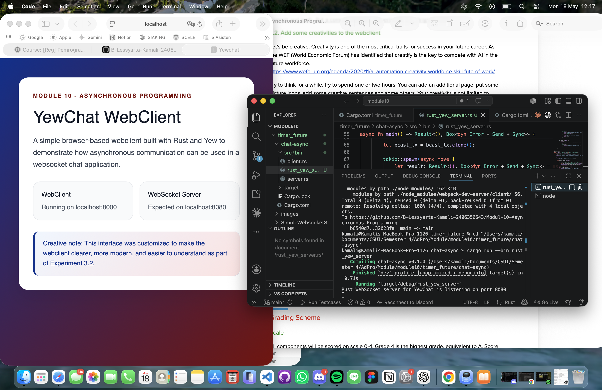

# Experiment 1.2: Understanding how it works

## Screenshot


## Explanation
Pada eksperimen ini, saya menambahkan satu println! tepat setelah spawner.spawn(...). Hasilnya, teks "Kamali's Komputer: hey hey" tampil di output sebelum teks dari task async. Hal ini terjadi karena spawner.spawn(...) hanya memasukkan task ke dalam queue executor, tetapi task tersebut belum langsung dijalankan sampai executor.run() dipanggil. Sementara itu, println! setelah spawn berada di alur utama program, sehingga dieksekusi terlebih dahulu. Setelah drop(spawner) dipanggil, executor mulai menjalankan task yang ada di queue. Task baru mencetak "Kamali's Komputer: howdy!", lalu menunggu TimerFuture selama dua detik, kemudian melanjutkan eksekusi dan mencetak "Kamali's Komputer: done!".

# Experiment 1.3: Multiple Spawn and removing drop

## Screenshot

Multiple spawn with drop(spawner);:


Without drop(spawner);:


## Explanation

Pada eksperimen ini, saya mereplikasi spawner.spawn(...) menjadi tiga task async. Setiap task mencetak pesan awal, menunggu TimerFuture selama dua detik, lalu mencetak pesan selesai. Efek dari spawning adalah task dimasukkan ke dalam queue executor untuk dijalankan. Karena ada tiga task, executor akan menjalankan task-task tersebut dan setiap task dapat berhenti sementara ketika menunggu timer.

Spawner berfungsi untuk memasukkan task baru ke dalam task queue. 
Executor berfungsi untuk mengambil task dari queue, melakukan polling terhadap future, dan menjalankan future sampai selesai. 

Ketika future belum selesai, task akan disimpan kembali agar bisa dilanjutkan ketika sudah siap. drop(spawner) berfungsi untuk menutup sisi pengirim task sehingga executor mengetahui bahwa tidak akan ada task baru lagi.

Ketika drop(spawner) dikomen/dihapus, program tidak langsung selesai walaupun task sudah mencetak output. Hal ini terjadi karena channel pengirim masih hidup, sehingga executor masih menunggu kemungkinan ada task baru yang masuk. Ketika drop(spawner) dikembalikan, executor dapat berhenti setelah semua task di queue selesai dijalankan.

# Experiment 2.1: Original code, and how it run

## Screenshot



## How to Run

To run the broadcast chat application, first enter the `chat-async` directory.

```bash
cd chat-async
```

Kemudian jalankan server dengan command berikut:
```bash
cargo run --bin server
```

Server akan berjalan pada alamat 127.0.0.1:2000.

Setelah server berjalan, buka tiga terminal baru untuk menjalankan tiga client. Pada masing-masing terminal client, masuk ke folder project chat:
```bash
cd chat-async
```

Lalu jalankan command berikut:
```bash
cargo run --bin client
```

Setelah semua client berhasil terhubung ke server, ketik pesan dari salah satu client. Pesan tersebut akan dikirim ke server, lalu server akan membroadcast pesan tersebut ke client-client yang sedang terhubung.

### Penjelasan

Pada eksperimen ini, saya menjalankan satu server dan tiga client sesuai instruksi tutorial. Server berperan sebagai pusat koneksi yang menerima pesan dari client melalui websocket. Setiap client terhubung ke server menggunakan alamat ws://127.0.0.1:2000.

Ketika salah satu client mengetik pesan, pesan tersebut dikirim ke server. Server kemudian menerima pesan tersebut dan mengirimkannya kembali melalui broadcast channel ke client-client yang terhubung. Dengan demikian, pesan yang diketik dari satu client dapat terlihat di client lainnya.

Eksperimen ini menunjukkan penggunaan asynchronous programming pada aplikasi chat. Server perlu menangani beberapa client secara bersamaan, menerima pesan dari client, dan mengirimkan pesan ke client lain tanpa harus menunggu satu proses selesai terlebih dahulu. Karena itu, websocket dan asynchronous programming cocok digunakan untuk kasus broadcast chat seperti ini.

# Experiment 2.2: Modifying port

## Screenshot



## Penjelasan

Pada eksperimen ini, saya mengubah port websocket dari 2000 menjadi 8080. Perubahan dilakukan pada dua sisi, yaitu server dan client. Pada sisi server, port diubah di file src/bin/server.rs, tepatnya pada bagian TcpListener::bind("127.0.0.1:8080"). Pada sisi client, port diubah di file src/bin/client.rs, tepatnya pada bagian URI websocket menjadi ws://127.0.0.1:8080.

Perubahan perlu dilakukan pada kedua sisi karena websocket adalah koneksi antara client dan server. Jika hanya server yang diubah tetapi client masih mengarah ke port lama, client tidak akan bisa terhubung. Sebaliknya, jika hanya client yang diubah tetapi server masih berjalan di port lama, koneksi juga gagal.

Protocol yang digunakan tetap sama, yaitu ws. Protocol ini didefinisikan pada URI websocket di file src/bin/client.rs, yaitu pada bagian ws://127.0.0.1:8080. Setelah port diubah pada server dan client, aplikasi tetap dapat berjalan dengan baik, dan pesan dari satu client masih dapat diterima oleh client lain.

# Experiment 2.3: Small changes, add IP and Port

## Screenshot



## Penjelasan

Pada eksperimen ini, saya menambahkan informasi IP dan port pengirim pada pesan yang diterima oleh client. Perubahan dilakukan di file src/bin/server.rs, khususnya pada fungsi handle_connection. Bagian yang diubah adalah ketika server menerima pesan dari salah satu client, sebelum pesan tersebut dikirim melalui broadcast channel.

Sebelumnya, server hanya mengirim isi pesan saja dengan bcast_tx.send(text.to_string()). Setelah dimodifikasi, server mengirim pesan dengan format format!("{addr}: {text}"). Variabel addr berisi alamat socket client yang mengirim pesan, sehingga client lain dapat melihat dari IP dan port mana pesan berasal.

Perubahan ini dilakukan di sisi server karena server adalah pihak yang menerima koneksi dari semua client dan mengetahui alamat masing-masing client. Dengan menambahkan informasi IP dan port di server, setiap pesan yang dibroadcast ke client menjadi lebih informatif. Setelah perubahan dilakukan, aplikasi tetap berjalan dengan baik, dan pesan yang diterima client menampilkan alamat pengirim beserta isi pesannya.

# Experiment 3.1: Original code

## Screenshot



## How to Run

Pada eksperimen ini, saya menjalankan dua project sesuai instruksi tutorial, yaitu `SimpleWebsocketServer` sebagai websocket server dan `YewChat` sebagai webclient.

Pertama, websocket server dijalankan dari folder `SimpleWebsocketServer`.

```bash
cd SimpleWebsocketServer
npm i
npm start
```

Server berjalan pada localhost:8080.

Setelah itu, webclient dijalankan dari folder YewChat.

```bash
cd YewChat
npm i
RUSTFLAGS="-C target-feature=-reference-types" npm start
```

Webclient dapat dibuka melalui browser pada alamat http://localhost:8000/.

### Penjelasan
Pada eksperimen ini, saya menjalankan websocket server dan webclient sesuai instruksi tutorial. Websocket server berjalan pada port 8080, sedangkan webclient YewChat berjalan pada port 8000. Ketika localhost:8080 dibuka langsung melalui browser, browser menampilkan pesan Upgrade Required karena port tersebut merupakan websocket server dan bukan halaman web biasa.

Project YewChat yang digunakan merupakan project lama, sehingga terdapat beberapa penyesuaian agar dapat dijalankan pada environment Rust saat ini. Dependency wasm-bindgen perlu disesuaikan karena versi lama tidak kompatibel dengan Rust terbaru. Webpack juga perlu diperbarui agar dapat memproses hasil build WebAssembly. Selain itu, webclient dijalankan menggunakan RUSTFLAGS="-C target-feature=-reference-types".

Setelah penyesuaian tersebut, webclient berhasil dijalankan dan dapat menampilkan halaman YewChat pada localhost:8000. Eksperimen ini menunjukkan perbedaan antara websocket server dan webclient berbasis browser. Server websocket bertugas menangani koneksi, sedangkan webclient bertugas menampilkan antarmuka aplikasi kepada pengguna.

# Experiment 3.2: Be Creative!

## Screenshot



## Penjelasan

Pada eksperimen ini, saya menambahkan kreativitas pada webclient YewChat dengan mengubah tampilan halaman utama agar lebih menarik dan mudah dipahami. Perubahan dilakukan pada file src/lib.rs, pada komponen Main yang dirender oleh Yew.

Saya menambahkan layout berbentuk card, background gradient yellow and pink, judul yang lebih jelas, informasi port webclient dan websocket server, dan chat interface. Perubahan ini tidak mengubah konsep utama dari tutorial, tetapi membuat tampilan webclient lebih informatif secara visual.

Webclient tetap dijalankan melalui localhost:8000, sedangkan websocket server tetap berjalan pada localhost:8080. Dengan perubahan ini, pengguna dapat langsung memahami bahwa aplikasi terdiri dari dua bagian, yaitu webclient berbasis Yew dan websocket server.

# Bonus: Rust Websocket server for YewChat!

## Screenshot



## How to Run

Pada bagian bonus ini, saya mengganti websocket server JavaScript dari Tutorial 3 dengan websocket server berbasis Rust yang dibuat dari pengembangan server pada Tutorial 2. Server Rust dijalankan dari folder `chat-async`.

```bash
cd chat-async
cargo run --bin rust_yew_server
```

Server Rust berjalan pada alamat 127.0.0.1:8080.

Setelah server Rust berjalan, webclient YewChat dijalankan dari folder YewChat.

```bash
cd YewChat
RUSTFLAGS="-C target-feature=-reference-types" npm start
```

Webclient dapat dibuka melalui browser pada alamat http://localhost:8000/.

### Penjelasan

Pada bagian bonus ini, saya membuat websocket server berbasis Rust agar YewChat tidak lagi bergantung pada server JavaScript tersebut. Server Rust dibuat dalam file chat-async/src/bin/rust_yew_server.rs.

Perubahan utama yang dilakukan adalah membuat server Rust berjalan pada port 8080, karena YewChat mengharapkan websocket server berada pada localhost:8080. Server ini menerima koneksi websocket dari client, membaca pesan yang dikirim oleh client, lalu membroadcast pesan tersebut ke client lain yang terhubung.

Server bonus ini meneruskan pesan dalam bentuk text apa adanya. Hal ini penting karena pada Tutorial 3, pesan dari YewChat dapat dikirim sebagai JSON yang sudah diserialisasi menjadi text message. Jika server menambahkan prefix seperti IP dan port ke dalam isi pesan, format JSON dapat rusak. Karena itu, server Rust pada bonus ini tidak mengubah isi pesan, tetapi hanya meneruskan text message yang diterima.

Perubahan ini dapat dianggap berhasil karena websocket server JavaScript dapat digantikan oleh server Rust yang berjalan pada port yang sama, yaitu 8080. Menurut saya, versi Rust lebih menarik untuk konteks pembelajaran asynchronous programming karena seluruh alur server dapat dipahami dalam bahasa yang sama dengan materi tutorial. Namun, versi JavaScript lebih praktis untuk web development karena ekosistemnya lebih umum digunakan untuk aplikasi frontend dan websocket berbasis browser.